# 🌤️ Real-Time Weather Data Streaming with Kafka, Docker, Python, and Microsoft Fabric

A comprehensive data engineering project demonstrating real-time weather data streaming and analysis.

## 🚀 Project Overview

This project implements a complete real-time data streaming pipeline:
- **Kafka Producer**: Fetches weather data from WeatherAPI every 60 seconds
- **Python Consumer**: Real-time wind speed monitoring
- **Spark Consumer**: 5-minute average temperature calculations in Microsoft Fabric
- **Delta Lake**: Persistent storage in Fabric Lakehouse

## 📊 Architecture
WeatherAPI → Kafka Producer → Kafka Cluster → Python Consumer (Wind Speed)
↓
Spark Consumer (Fabric) → Delta Lake → Analytics

## 🛠️ Tech Stack

- **Apache Kafka** with Docker
- **Python** with kafka-python, requests
- **Microsoft Fabric** with Spark Structured Streaming
- **Delta Lake** for data storage
- **Ngrok** for public tunneling
- **WeatherAPI** for data source

## 📁 Project Structure
```bash
WeatherDataStreaming/
├── docker-compose.yml # Kafka and Zookeeper setup
├── requirements.txt # Python dependencies
├── .gitignore # Git ignore rules
├── README.md # Project documentation
├── .env.example # Environment variables template
├── src/
│ ├── producer.py # Kafka producer for weather data
│ └── consumer.py # Kafka consumer for real-time monitoring
└── scripts/
  └── setup_ngrok_kafka.py # Automated Ngrok and Kafka setup
  └── setup_ngrok_kafka.py # Windows automated setup (PowerShell)
```
## 📊 System Architecture

```mermaid
---
title: Weather Data Streaming Pipeline
---
flowchart TB
    WEATHER[🌤️ Weather API] --> PRODUCER[🐍 Python Producer]
    PRODUCER --> KAFKA[⚡ Kafka Cluster]
    KAFKA --> CONSUMER[🐍 Python Consumer]
    KAFKA --> NGROK[🔗 Ngrok Tunnel]
    NGROK --> FABRIC[☁️ Microsoft Fabric<br/>End-to-end analytics platform]
    
    classDef source fill:#e3f2fd,stroke:#1976d2,stroke-width:2px,color:#000000
    classDef processing fill:#e8f5e8,stroke:#388e3c,stroke-width:2px,color:#000000
    classDef fabric fill:#fff3e0,stroke:#ef6c00,stroke-width:2px,color:#000000
    
    class WEATHER source
    class PRODUCER,KAFKA,CONSUMER,NGROK processing
    class FABRIC fabric
```


## ⚡ Quick Start
### Prerequisites
- Docker Desktop
- Python 3.9+
- Microsoft Fabric Account
- WeatherAPI Account

### 1. Clone and Setup
```bash
git clone <your-repo-url>
cd DataEngineering_Module_Week_10
```
### 2. Environment Setup
```bash
# Copy and edit environment template
cp .env.example .env
# Add your WEATHER_API_KEY to .env file
```
### 3. Start Services
```bash
# Start Kafka with Docker
docker-compose up -d

# Install Python dependencies
pip install -r requirements.txt

# Run producer
python src/producer.py

# Run consumer (in another terminal)
python src/consumer.py
```
### 4. Microsoft Fabric Setup
1. Create Lakehouse in Fabric

1. Use provided Spark code for streaming analytics

1. Connect via Ngrok public URL

### 🪟 Windows Users - Automated Setup

For Windows users, we provide a PowerShell script that automates the entire setup process:

```powershell
# Run PowerShell as Administrator and execute:
.\scripts\setup_ngrok_kafka.ps1
```
Features:

- ✅ Automatic dependency checks (Python, Docker, Ngrok)

- ✅ One-click Ngrok tunnel setup

- ✅ Automatic Kafka configuration updates

- ✅ Color-coded progress indicators

- ✅ Comprehensive error handling


### 🔧 Alternative Setup Methods

#### Python Script (Cross-Platform)
```bash
# Works on Windows, Mac, and Linux
python scripts/setup_ngrok_kafka.py
```

#### Manual Setup
```bash
docker-compose up -d
ngrok tcp 9093
# Update KAFKA_ADVERTISED_LISTENERS in docker-compose.yml manually
docker-compose restart kafka
```

## 📈 Features
- ✅ Real-time weather data ingestion

- ✅ Kafka cluster with Docker

- ✅ Python consumer for immediate monitoring

- ✅ Spark Structured Streaming for complex aggregations
- ✅ Delta Lake integration for reliable storage
- ✅ Windows automated setup with PowerShell scripts
- ✅ 5-minute sliding window averages

- ✅ Public access via Ngrok tunneling

## 🔧 Configuration
### Environment Variables
Create ```.env``` file with:

```env
WEATHER_API_KEY=your_api_key_here
KAFKA_BROKER_LOCAL=localhost:9092
KAFKA_BROKER_PUBLIC=localhost:9093
KAFKA_TOPIC=weather_data
```
Kafka Topics
- ```weather_data```: Raw weather data stream

## 📊 Data Schema
### Producer Output
```json
{
  "city": "Amsterdam",
  "temperature_c": 11.0,
  "temperature_f": 51.8,
  "humidity": 85,
  "wind_speed_kph": 22.0,
  "wind_speed_mph": 13.6,
  "local_time": "2025-11-11 03:00",
  "last_updated": "2025-11-11 03:00",
  "timestamp": "2025-11-11T03:00:26.356684"
}
```
### Delta Table Schema
```sql
CREATE TABLE avg_temperature (
  window_start TIMESTAMP,
  window_end TIMESTAMP,
  city STRING,
  avg_temperature_c DOUBLE,
  avg_temperature_f DOUBLE,
  avg_humidity DOUBLE,
  avg_wind_speed_kph DOUBLE,
  message_count LONG,
  computation_time TIMESTAMP
)
```

## 🔄 Data Flow
### 1. Data Ingestion (Producer)
- Fetches current weather data from WeatherAPI every 60 seconds

- Sends structured JSON data to Kafka topic

### 2. Real-time Monitoring (Python Consumer)
- Consumes messages from Kafka in real-time

- Displays wind speed and weather conditions

- Runs continuously for live monitoring

### 3. Stream Processing (Spark Consumer)
- Reads from Kafka using Structured Streaming

- Applies 5-minute sliding windows with 1-minute intervals

- Calculates average temperature, humidity, and wind speed

- Stores results in Delta Lake table

### 4. Data Persistence (Delta Lake)
- Provides ACID transactions

- Supports time travel and versioning

- Enables efficient querying and analytics

## 🐳 Docker Setup
The project uses Docker Compose to run Kafka and Zookeeper:

```yaml
version: '3.8'
services:
  zookeeper:
    image: confluentinc/cp-zookeeper:latest
    environment:
      ZOOKEEPER_CLIENT_PORT: 2181
      ZOOKEEPER_TICK_TIME: 2000

  kafka:
    image: confluentinc/cp-kafka:latest
    depends_on:
      - zookeeper
    ports:
      - "9092:9092"
      - "9093:9093"
    environment:
      KAFKA_BROKER_ID: 1
      KAFKA_ZOOKEEPER_CONNECT: zookeeper:2181
      KAFKA_ADVERTISED_LISTENERS: PLAINTEXT://kafka:29092,PLAINTEXT_HOST://localhost:9092
      KAFKA_LISTENER_SECURITY_PROTOCOL_MAP: PLAINTEXT:PLAINTEXT,PLAINTEXT_HOST:PLAINTEXT
      KAFKA_INTER_BROKER_LISTENER_NAME: PLAINTEXT
      KAFKA_OFFSETS_TOPIC_REPLICATION_FACTOR: 1
```
## 🔌 Ngrok Configuration
For public access to local Kafka (required for Microsoft Fabric):

```bash
# Install Ngrok and start tunnel
ngrok tcp 9093

# Update docker-compose.yml with public URL
KAFKA_ADVERTISED_LISTENERS: PLAINTEXT://kafka:29092,PLAINTEXT_HOST://localhost:9092,EXTERNAL://<ngrok-url>
```
## 💻 Code Examples
Producer (src/producer.py)
```python
class WeatherDataProducer:
    def fetch_weather_data(self):
        # Fetches data from WeatherAPI
        pass
    
    def send_to_kafka(self, weather_data):
        # Sends data to Kafka topic
        pass
```    
Consumer (src/consumer.py)
```python
class WeatherDataConsumer:
    def start_consuming(self):
        # Continuously consumes and displays wind speed
        pass
```
Spark Streaming (Fabric Notebook)
```python
# 5-minute windowed averages
windowed_avg_df = parsed_stream_df \
    .withWatermark("processing_timestamp", "10 minutes") \
    .groupBy(
        window(col("processing_timestamp"), "5 minutes", "1 minute"),
        col("city")
    ) \
    .agg(avg("temperature_c").alias("avg_temperature_c"))
```
## 📈 Monitoring and Debugging
Kafka UI
Accessible at: http://localhost:8081

- View topics and messages

- Monitor consumer groups

- Check broker status

Log Files
- Producer logs: Weather API calls and Kafka sends

- Consumer logs: Message consumption and processing

- Spark logs: Streaming queries and Delta operations

Common Issues and Solutions
1. Kafka Connection Issues
   - Check Docker containers are running
   - Verify ports 9092 and 9093 are available

2. Weather API Limits
   - Free tier: 1 million calls/month
   - Monitor usage in WeatherAPI dashboard

3. Ngrok Tunnel Drops
   - Restart Ngrok tunnel
   - Update Kafka advertised listeners

## 🚀 Deployment Options
### Local Development
- Docker Compose for Kafka

- Python scripts for producer/consumer

- Local Spark for testing

### Cloud Deployment
- Kafka: Confluent Cloud, AWS MSK, Azure Event Hubs

- Processing: Azure Databricks, AWS EMR

- Storage: Azure Data Lake, AWS S3

### Microsoft Fabric Integration
- Lakehouse for data storage

- Notebooks for Spark processing

- Power BI for visualization

## 🤝 Contributing
1. Fork the project

2. Create your feature branch (git checkout -b feature/AmazingFeature)

3. Commit your changes (git commit -m 'Add some AmazingFeature')

4. Push to the branch (git push origin feature/AmazingFeature)

5. Open a Pull Request

## 📝 License
This project is for educational purposes as part of Data Engineering training.

## 🙏 Acknowledgments
- WeatherAPI for providing weather data

- Apache Kafka community

- Microsoft Fabric team

- Docker and Python communities

- We'RHERE IT Academy community for training


#### ⭐ If you find this project helpful, please give it a star! ⭐